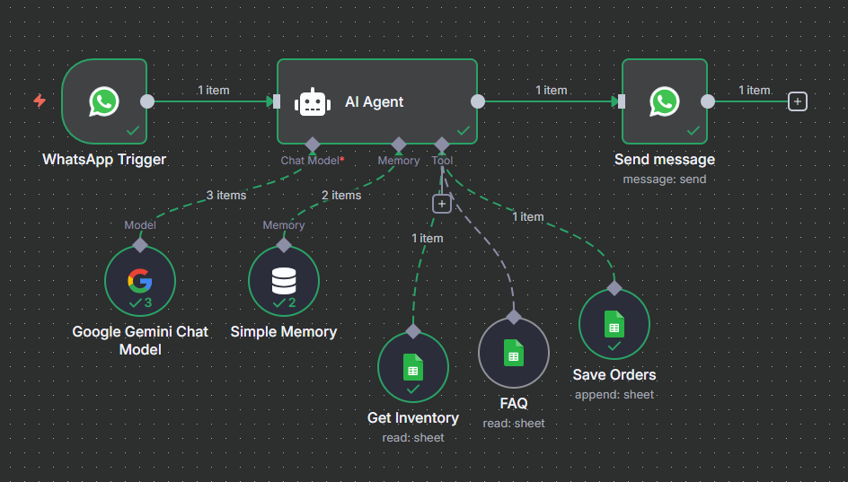

# n8n Automations 🚀

This repository contains a collection of automation workflows built with [n8n](https://n8n.io/).  

### 1. Lead Capture & Notification (Form → Google Sheets + Email)
**Description:** Automates lead management by capturing form submissions, saving them into Google Sheets as a centralized database, and instantly sending an email alert with the lead’s details. This ensures no potential lead is missed and the team can follow up quickly.

**Screenshot:**  

### 2. Real Estate Client Automation with AI (Google Sheets + API + OpenAI → Dynamic Email)
**Description:** Enhances client onboarding for real estate using both API enrichment and AI-powered communication. When new client data (ID, Name, Number, Budget) is submitted:  
1. Gender is predicted using **Genderize.io** API.  
2. Nationality is predicted using **Nationalize.io** API.  
3. Both predictions are appended to Google Sheets alongside the client data.  
4. The full client details are passed into an **OpenAI model**, which generates a well-structured and professional email template.  
5. The dynamically crafted email is sent to notify the team about the new client.  

**Screenshot:**  

### 3. WhatsApp AI Agent for Order Management (WhatsApp + Google Gemini + Google Sheets)

**Description:** Automates order management through WhatsApp using an intelligent AI agent powered by Google Gemini. When customers send messages via WhatsApp, the AI agent handles inquiries, checks inventory availability, and processes orders seamlessly. The system maintains conversation memory and uses Google Sheets as both a database and toolkit for real-time operations.

**Key Features:**
- **Smart Order Processing:** AI agent understands customer requests and processes food orders
- **Real-time Inventory Check:** Automatically verifies item availability before confirming the orders
- **Conversation Memory:** Maintains context throughout the chat session for natural interactions
- **FAQ Support:** Instantly answers common customer questions
- **Automated Data Management:** Orders are automatically saved to Google Sheets with customer details

**How it works:**
1. Customer sends a message via WhatsApp (trigger activated)
2. **Google Gemini AI Agent** processes the message with conversation memory
3. Agent checks **Inventory Sheet** to verify item availability (Available/Out of Stock)
4. For questions, agent references **FAQ Sheet** to provide instant answers
5. For orders, agent validates items and saves order details to **Orders Sheet**
6. AI responds to customer with order confirmation or alternative suggestions

**Screenshot:**  

