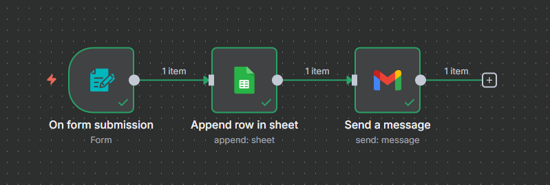

# n8n Automations 🚀

This repository contains a collection of automation workflows built with [n8n](https://n8n.io/).  

### 1. Lead Capture & Notification (Form → Google Sheets + Email)
**Description:** Automates lead management by capturing form submissions, saving them into Google Sheets as a centralized database, and instantly sending an email alert with the lead’s details. This ensures no potential lead is missed and the team can follow up quickly.

**Screenshot:**  

### 2. Real Estate Client Automation with AI (Google Sheets + API + OpenAI → Dynamic Email)
**Description:** Enhances client onboarding for real estate using both API enrichment and AI-powered communication. When new client data (ID, Name, Number, Budget) is submitted:  
1. Gender is predicted using **Genderize.io**.  
2. Nationality is predicted using **Nationalize.io**.  
3. Both predictions are appended to Google Sheets alongside the client data.  
4. The full client details are passed into an **OpenAI model**, which generates a well-structured and professional email template.  
5. The dynamically crafted email is sent to notify the team about the new client.  

**Screenshot:**  

